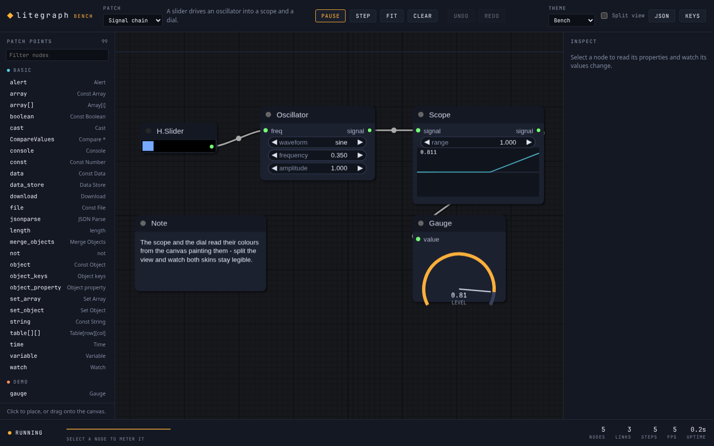
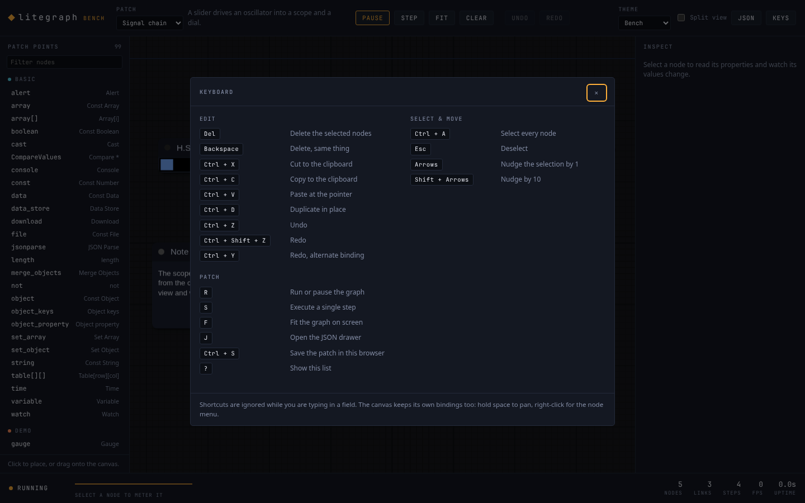

# LiteGraph bench

A full node editor built on the React wrapper, meant to be read as much as used.
Everything in it is ordinary application code calling the public API - there are no
private hooks into LiteGraph - so any piece of it can be lifted into your own app.



```sh
make demo          # from the repository root: installs deps, starts Vite
make demo-test     # the vitest suite for this folder
make demo-build    # production build into react-demo/dist
```

Or, from this folder: `npm install && npm run dev`.

## What it demonstrates

| Area | Where to look |
| --- | --- |
| Mounting a canvas, sizing it to its container | `src/components/EditorCanvas.jsx` |
| Per-canvas theming, two skins on one graph | `src/themes.js`, the **Split view** toggle |
| Writing custom nodes: widgets, drawing, events | `src/demoNodes.js` |
| Building graphs in code | `src/examples.js` |
| Reading the node registry for a palette | `src/demoSetup.js` |
| Selection, live values, property editing | `src/components/Inspector.jsx` |
| Serialising, importing, browser storage | `src/graphTools.js`, `src/components/JsonPanel.jsx` |
| Clipboard, delete, duplicate, undo/redo | `src/editing.js` |
| The keymap, and the sheet that documents it | `src/shortcuts.js` |

## Using it

- **Place nodes** by clicking an entry in the left rail, or drag one onto the canvas
  to drop it exactly where you want it.
- **Wire nodes** by dragging from an output dot to an input dot. Right-click the
  canvas for LiteGraph's own node menu.
- **Inspect** a node by selecting it: the right rail shows its properties, its
  execution mode, and the values moving through its slots.
- **Split the view** to render the same running graph through two themes at once.
  Both panes are views of one `LGraph`, not two copies.
- **Export** from the JSON drawer. A graph is plain JSON: download it, paste it
  back, or keep it in the browser between sessions.

## Keyboard

Press `?` for the list in the app. It is generated from `src/shortcuts.js`, so it
cannot drift from what the handler actually does.



| | |
| --- | --- |
| `Del` / `Backspace` | Delete the selected nodes |
| `Ctrl/⌘ X` `C` `V` | Cut, copy, paste - paste lands under the pointer |
| `Ctrl/⌘ D` | Duplicate in place |
| `Ctrl/⌘ Z` / `Ctrl/⌘ Shift Z` | Undo / redo |
| `Ctrl/⌘ A` / `Esc` | Select everything / deselect |
| Arrows, `Shift` + arrows | Nudge the selection by 1 or 10 |
| `R` `S` `F` `J` | Run/pause, step, fit, JSON drawer |
| `Ctrl/⌘ S` | Save the patch in this browser |

Two details worth copying if you build your own editor:

- The handler listens on `window` **in the capture phase**. LiteGraph binds its own
  `keydown` to the canvas element and implements delete, select-all, copy and
  paste itself, so anything that reaches it fires twice - a Ctrl+V would paste two
  copies. Getting there first and calling `stopPropagation` for handled keys keeps
  one implementation. Unhandled keys still reach the canvas, so hold-space to pan
  and per-node `onKeyDown` keep working.
- Undo snapshots the serialised graph and is driven by `graph.onAfterChange`,
  which means edits made *through the canvas* - dragging a node, drawing a wire,
  deleting from the context menu - are undoable without wrapping any of them.
  LiteGraph fires that callback several times for one logical edit, so records are
  coalesced to the end of the task; otherwise deleting three nodes would take
  three presses to take back.

## The custom nodes

Registered under `demo/` by `src/demoNodes.js`:

| Node | Shows |
| --- | --- |
| `oscillator` | Combo and number widgets bound to properties; an input that overrides a widget for one frame without overwriting it |
| `scope` | `onDrawBackground` with a ring buffer, and a pass-through slot |
| `gauge` | Canvas drawing driven by an input value |
| `swatch` | Several inputs mixed into one output, drawn as a colour |
| `metronome` | `triggerSlot` on an event output, driven by graph time |
| `note` | A property rendered as wrapped text, edited from the inspector |

The drawing nodes take their colours from the canvas painting them
(`graphcanvas.theme`) rather than the `LiteGraph.*` globals. That is what keeps
them readable in the split view, where the same node is painted twice in two
different skins in the same frame.

## Tests

`npm test` runs vitest against jsdom. `src/test/setup.js` stubs the 2D context and
`ResizeObserver`, which jsdom does not implement. The suites cover the custom
nodes' behaviour, every example patch (build, execute, JSON round trip), the view
and serialisation helpers, and the app itself driven through the DOM.
